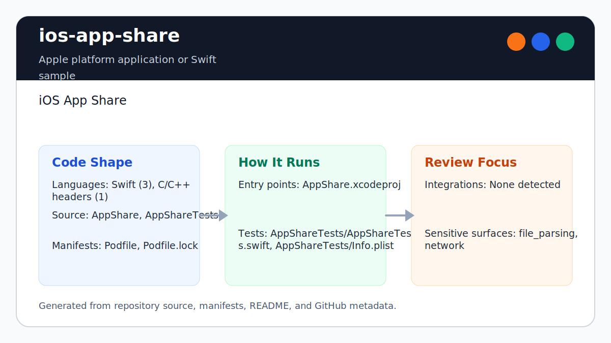

# ios-app-share

<!-- README-OVERVIEW-IMAGE -->


## Overview

`garethpaul/ios-app-share` is a Apple platform application or Swift sample. iOS App Share

This README is based on the checked-in source, manifests, scripts, and repository metadata on the `master` branch. The project language mix found during review was: Swift (3), C/C++ headers (1).

## Repository Contents

- `CHANGES.md` - concise history of maintenance changes
- `Makefile` - local verification entry point
- `Podfile` - Apple platform dependency metadata
- `AppShare` - source or example code
- `AppShare.xcodeproj` - Xcode project file
- `AppShare.xcworkspace` - Xcode workspace including the CocoaPods project
- `AppShareTests` - source or example code
- `Podfile.lock` - Apple platform dependency metadata
- `SECURITY.md` - security reporting and disclosure guidance
- `scripts/check-baseline.py` - static iOS app-detection verifier
- `VISION.md` - project direction and maintenance guardrails

Additional scan context:

- Source directories: AppShare, AppShareTests
- Dependency and build manifests: Podfile, Podfile.lock
- Entry points or build surfaces: `make check`, AppShare.xcworkspace, AppShare.xcodeproj
- Test-looking files: AppShareTests/AppShareTests.swift, AppShareTests/Info.plist

## Getting Started

### Prerequisites

- Git
- macOS with Xcode for building Apple platform projects
- CocoaPods 0.36.1 era tooling if dependencies need to be installed or regenerated
- Python 3 for local static verification on non-macOS hosts

### Setup

```bash
git clone https://github.com/garethpaul/ios-app-share.git
cd ios-app-share
make lint
make test
make build
make check
```

Run `pod install` only from a compatible CocoaPods environment when you intentionally need to regenerate the workspace support files.

## Running or Using the Project

- Open `AppShare.xcworkspace` in Xcode so the app and CocoaPods projects are loaded together.
- Tap the detection button in the sample app to inspect `iHasApp` behavior locally.
- Do not upload, persist, or log detected installed-app data without a dedicated privacy design and user consent.

## Testing and Verification

Run the local static baseline:

```bash
make lint
make test
make build
make check
```

The `lint`, `test`, and `build` targets intentionally alias the static baseline
on hosts without the legacy Xcode toolchain, so the standard local gate commands
stay available while preserving the single source of truth.

The baseline runs `scripts/check-baseline.py`, parses plist/storyboard/workspace XML, checks CocoaPods lockfile and Xcode metadata, verifies the Swift source inventory, and guards against automatic startup detection, duplicate scans, missing in-progress detection UI state, missing completed state button disabling, missing accessibility text for the local-only detection action, callback UI updates that skip the main queue, logging, or network/upload handling for local-only installed-app detection results.
It also checks state-specific accessibility text for the running, completed,
and retry states of the installed-app detection button.
Detector lifetime is guarded so the asynchronous `iHasApp` scan remains
retained until success or failure callbacks finish.

For full legacy verification on macOS, use Xcode's test action or `xcodebuild test` with the appropriate scheme and destination.

When the required SDK or runtime is unavailable, use static checks and source review first, then verify on a machine that has the matching platform toolchain.

## Configuration and Secrets

- No required secret or credential file was identified in the repository scan. If you add integrations later, keep secrets out of git.

## Security and Privacy Notes

- Review changes touching network requests, sockets, or service endpoints; examples from the scan include AppShare/Info.plist, AppShareTests/Info.plist.
- Review changes touching file, media, JSON, XML, CSV, OCR, or data parsing; examples from the scan include AppShare/Info.plist, AppShareTests/Info.plist.
- Installed-app detection is sensitive device metadata. Keep the sample local-only and user-triggered, avoid debug logging of detection results or counts, and document any future data flow before adding storage or transmission.
- Keep the detection button accessibility text aligned with the local-only
  privacy boundary.

## Maintenance Notes

- This looks like an Apple platform project or sample. Xcode, Swift, CocoaPods, and deployment target versions may need to match the original project era.
- See `SECURITY.md` for vulnerability reporting and safe research guidance.
- See `VISION.md` for project direction and contribution guardrails.
- See `docs/plans/2026-06-08-callback-ui-main-queue.md` for the detection callback UI threading guardrail.
- See `docs/plans/2026-06-09-detection-progress-state.md` for the installed-app detection in-progress UI guardrail.
- See `docs/plans/2026-06-09-detection-completed-state.md` for the installed-app detection completed state guardrail.
- See `docs/plans/2026-06-09-detection-accessibility-affordance.md` for the detection accessibility guardrail.
- See `docs/plans/2026-06-09-detection-accessibility-state.md` for
  state-specific accessibility text on the detection button.
- See `docs/plans/2026-06-09-detector-lifetime-guard.md` for the asynchronous
  detector lifetime guardrail.
- See `docs/plans/2026-06-09-make-gate-aliases.md` for the local gate alias guardrail.
- Run `make lint`, `make test`, `make build`, and `make check` before pushing changes to Swift sources, plist/storyboard files, CocoaPods metadata, app-detection behavior, or privacy documentation.

## Contributing

Keep changes small and tied to the project that is already present in this repository. For code changes, document the toolchain used, avoid committing generated dependency directories or local configuration, and update this README when setup or verification steps change.
