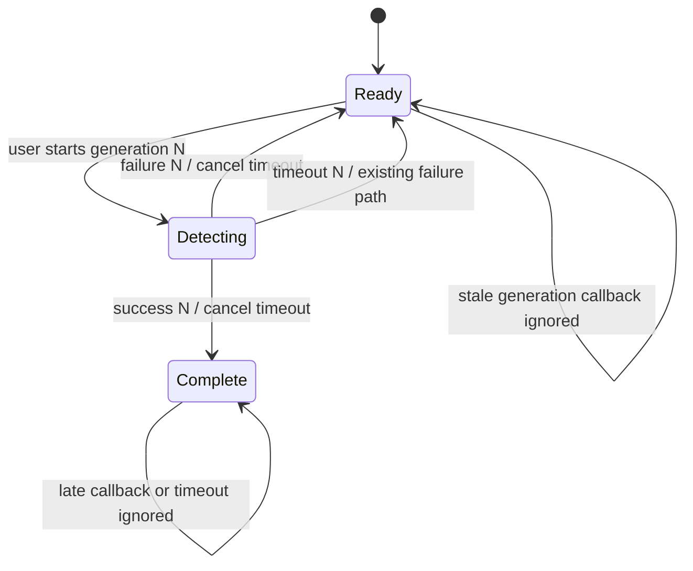

# Detector Completion Timeout

## Summary

Bound each user-triggered installed-app scan so a retired or malfunctioning
`iHasApp` detector cannot leave the interface disabled forever. A timeout for
the active generation should reuse the existing failure path, while later
success, failure, or stale timeout callbacks must remain harmless.

## Problem Frame

The current controller retains the detector and disables the action until
`iHasApp` invokes success or failure. If neither callback arrives, the user
cannot retry, the progress accessibility state remains active, and the detector
stays retained for the controller lifetime.

## Requirements

- R1. Schedule one bounded completion timeout for each accepted detection
  generation after detector construction succeeds.
- R2. Route an active-generation timeout through the existing failure terminal
  state so retry title, enabled state, accessibility copy, announcement, and
  detector cleanup remain consistent.
- R3. Invalidate the timeout before applying either terminal success or failure
  state.
- R4. Preserve the generation and in-progress guards so late detector callbacks
  and late timeout delivery cannot overwrite a newer or completed scan.
- R5. Preserve user-triggered, local-only detection, weak callback capture, main
  queue UI mutation, dependency locks, and legacy Swift compatibility.
- R6. Extend the static baseline and documentation with mutation-sensitive
  contracts for timeout scheduling, invalidation, and generation ownership.

## High-Level Technical Design

The following state sketch is directional guidance rather than implementation
syntax:

The timeout should be owned by the controller because the controller owns the
detector and UI state. It should carry the same immutable generation value as
the terminal callbacks, making the existing generation check the authority for
all completion races.

## Key Technical Decisions

- KTD1. Use a one-shot Foundation timer compatible with the repository's Swift
  era instead of adding concurrency or dependency machinery.
- KTD2. Reuse `finishDetection` for timeout recovery rather than duplicating
  retry-state mutations.
- KTD3. Cancel the retained timer at the start of an accepted terminal path;
  generation guards remain the secondary defense against queued late delivery.
- KTD4. Keep the timeout interval as a named controller constant so policy is
  visible and statically testable without exposing new public API.

## Scope Boundaries

- Do not modernize Swift, CocoaPods, `iHasApp`, project metadata, or deployment
  targets in this change.
- Do not log, persist, upload, or expose detected app data, counts, or errors.
- Do not claim device or simulator execution from Linux; hosted macOS project
  parsing remains authoritative for Apple tooling.
- Do not attempt to cancel unsupported third-party detector internals; release
  the retained detector and ignore any later callback by generation/state.

## Implementation Units

### U1. Add generation-owned timeout recovery

- **Goal:** Ensure every accepted scan reaches success, retry, or a bounded
  timeout recovery state.
- **Files:** `AppShare/ViewController.swift`
- **Design:** Retain one timer for the active generation, schedule it only after
  detector construction succeeds, invalidate it before accepted terminal state
  mutation, and route timeout delivery through generation-scoped failure.
- **Test scenarios:** A detector that never completes returns the button to
  retry; success and failure cancel the timer; a stale timer or detector
  callback cannot affect a later generation; nil detector construction still
  fails immediately without scheduling a timer.

### U2. Enforce the timeout lifecycle statically

- **Goal:** Make removal, reordering, duplicate scheduling, or unscoped timeout
  handling fail the canonical gate.
- **Files:** `scripts/check-baseline.py`
- **Design:** Verify the timer property and named interval, scheduling after the
  construction guard, generation capture, invalidation in the terminal helper,
  reuse of the failure path, and preservation of existing callback safeguards.
- **Test scenarios:** Isolated mutations removing scheduling, invalidation,
  generation forwarding, failure-path reuse, or source ordering are rejected;
  the unmodified source passes from repository and external directories.

### U3. Record the supported behavior and evidence

- **Goal:** Keep maintainer guidance and the plan truthful about the new
  lifecycle boundary and actual validation.
- **Files:** `README.md`, `SECURITY.md`, `VISION.md`, `CHANGES.md`,
  `AGENTS.md`, `docs/plans/2026-06-18-001-fix-detector-timeout-plan.md`
- **Design:** Document bounded recovery, late-callback rejection, privacy
  preservation, Linux limitations, and completed verification without claiming
  live device behavior.
- **Test scenarios:** The baseline rejects missing guidance, stale plan status,
  placeholder verification, and removal of recorded mutation evidence.

## Risks and Dependencies

- A timeout can surface retry while unsupported detector work continues
  internally; generation and in-progress checks must reject its late callback.
- The chosen interval is policy rather than a measured service guarantee because
  the retired dependency cannot be exercised on this Linux host.
- Static contracts cannot prove Foundation timer behavior on historical iOS;
  canonical hosted checks and a future credential-free device smoke test remain
  the strongest available follow-up evidence.

## Acceptance Examples

- AE1. Given a scan whose detector never calls a terminal callback, when the
  timeout fires for the active generation, then the detector is released and
  the button becomes an announced retry action.
- AE2. Given a scan that succeeds before the deadline, when the timer would have
  fired later, then completed state remains unchanged.
- AE3. Given a timed-out scan followed by a retry, when the old detector calls
  back, then the newer generation remains authoritative.

## Verification

- Run the canonical gate and all Make aliases from the checkout.
- Run the canonical gate through an absolute checkout path from an external
  directory.
- Parse maintained Python, plist, workflow, CocoaPods, and Xcode metadata with
  the existing truthful platform boundary.
- Reject isolated timeout lifecycle, documentation, plan-status, and evidence
  mutations.
- Audit the exact stacked diff, generated artifacts, conflict markers, file
  modes, and credential-shaped additions before commit and push.

## Open Questions

None block implementation. The timeout duration will use a conservative named
constant suitable for a sample application and remain easy to revise after
historical-device evidence becomes available.

## Work Completed

- Added a one-shot, generation-owned detector completion timeout that routes a
  stalled scan through the existing retry state.
- Invalidated and cleared the timeout before accepted terminal cleanup, while
  preserving the existing generation guard for queued late delivery.
- Extended the canonical checker and maintainer guidance for scheduling,
  invalidation, failure-path reuse, privacy, and late-callback rejection.

## Verification Completed

- All four Make gates passed in an isolated finalized-plan copy and again in the
  exact worktree; Linux truthfully skipped unavailable `xcodebuild` execution.
- The external-directory Make gate passed through the absolute checkout path.
- Six isolated timeout lifecycle mutations were rejected: removed timer
  retention, removed scheduling, removed invalidation, removed generation
  payload, changed timeout recovery to success, and a plan-evidence mutation.
- Python syntax, exact diff, generated-artifact, conflict-marker, file-mode, and
  credential-shaped addition audits passed.
